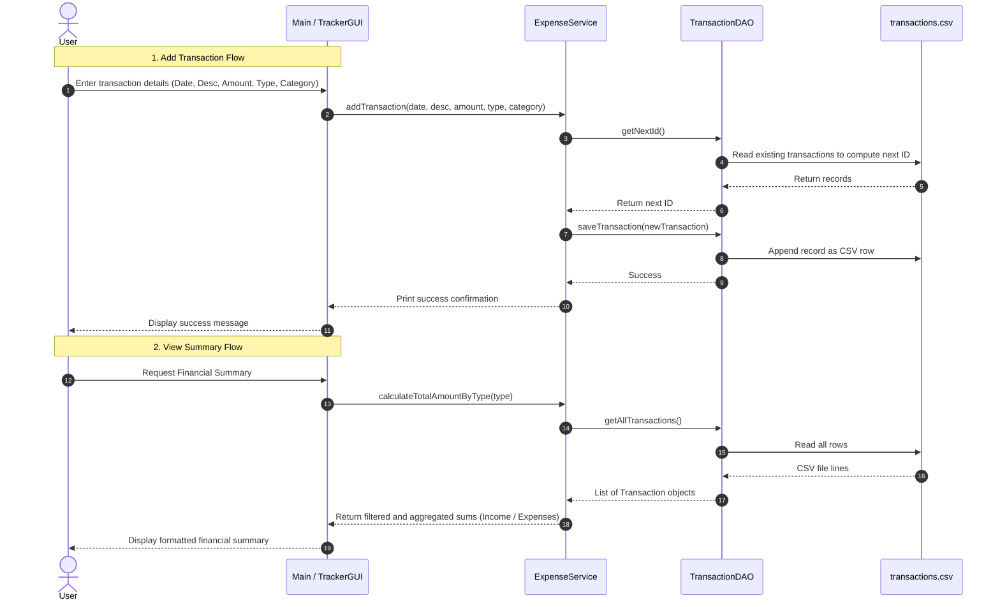

# Expense Tracker Finance Manager

Simple Java Personal Finance Tracker with:
- Console menu (add transaction, view all, view summary)
- Swing GUI for adding and viewing transactions
- CSV-based local persistence

## Tech Stack
- Java (JDK 8+)
- Standard Java libraries only (no external dependencies)

## Project Structure
```
ExpenseTracker/
	src/
		com/mycompany/expensetracker/
			Main.java
			TrackerGUI.java
			dao/TransactionDAO.java
			model/Transaction.java
			model/Category.java
			service/ExpenseService.java
		resources/data/transactions.csv
	bin/
```

## How It Works
1. `Main` starts the console menu.
2. Data operations go through `ExpenseService`.
3. `TransactionDAO` reads/writes CSV data.
4. Transactions are saved to `src/resources/data/transactions.csv`.


## CSV Format
File: `src/resources/data/transactions.csv`

Each row:
```text
id,date,description,amount,type,category
```

Example:
```text
1,2025-09-22,Ice Cream,200.00,Expense,FOOD
```


## Detailed Application Work Flow

This diagram illustrates how data flows between the user, business logic service, DAO layer, and the local CSV file:



### Process Step Details:
1. **Interactive CLI Menu Loop**: The application loops through options, collecting user input and validating inputs (such as validating dates using `LocalDate.parse` and categories using the `Category` enum values).
2. **Next ID Generation**: When saving a transaction, `TransactionDAO` determines the next auto-incrementing ID by retrieving all transactions, finding the maximum ID value, and adding `1`.
3. **Data Sanitization**: Before writing to the CSV, description strings are stripped of commas (`.replaceAll(",", "")`) to prevent row parsing conflicts.
4. **Data Deserialization**: When reading the CSV file, each line is split by commas, and fields are parsed to instantiate `Transaction` entities. Malformed lines are skipped gracefully.

---

## Architecture & Design Patterns

The project follows a standard multi-tiered structural pattern:
*   **Model Layer**: Represents application state.
    *   `Transaction` - holds transaction state.
    *   `Category` - enum representing available categories.
*   **DAO (Data Access Object) Layer**: Handles files, file paths, persistence, serialization, and deserialization.
    *   `TransactionDAO` - reads/writes files from/to `src/resources/data/transactions.csv`.
*   **Service Layer**: Handles core domain-specific business rules and aggregations.
    *   `ExpenseService` - exposes transaction aggregations, validation triggers, and high-level query methods.
*   **View Layer (UI)**: Responsible for display representation and capturing inputs.
    *   `Main` - Console input UI.
    *   `TrackerGUI` - Swing framework desktop UI.

---

## Running the Application

### 1. Compile the Project
From the project root directory (`Expense-Tracker-Finance-Manager`), run:
```powershell
javac -d bin src/com/mycompany/expensetracker/model/*.java src/com/mycompany/expensetracker/dao/*.java src/com/mycompany/expensetracker/service/*.java src/com/mycompany/expensetracker/util/*.java src/com/mycompany/expensetracker/*.java
```

### 2. Run the Console CLI Menu
Run:
```powershell
java -cp bin com.mycompany.expensetracker.Main
```

### 3. Run the GUI Window
*Note: The Swing GUI implementation is defined in `TrackerGUI.java` but doesn't have an entry point default `main` method. To test/run the GUI, add a `main` method to `TrackerGUI.java` or instantiate it from `Main.java`.*

---

## Troubleshooting
- If using PowerShell, do not use `&&` command chaining. Use `;`.
- If PowerShell blocks script execution, run this once in the same terminal:
  `Set-ExecutionPolicy -Scope Process -ExecutionPolicy Bypass`
- Date input must be `YYYY-MM-DD`.
- Type should be `Expense` or `Income`.
- Category should match enum values (for consistency):
	`FOOD, BILLS, TRANSPORTATION, ENTERTAINMENT, SALARY, GIFTS, HEALTH, MISCELLANEOUS`
