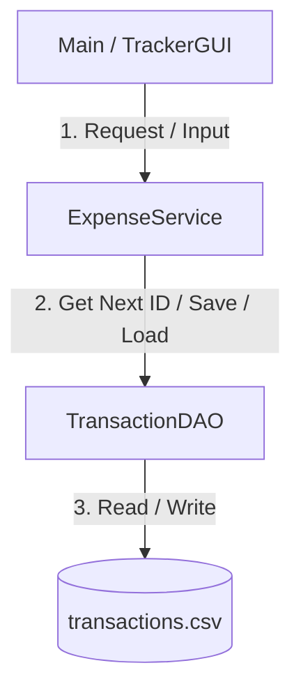

# Expense Tracker Finance Manager

Simple Java Personal Finance Tracker with:
- Console menu (add transaction, view all, view summary)
- Swing GUI for adding and viewing transactions
- CSV-based local persistence

## Tech Stack
- Java (JDK 8+)
- Standard Java libraries only (no external dependencies)

## Project Structure
```
ExpenseTracker/
	src/
		com/mycompany/expensetracker/
			Main.java
			TrackerGUI.java
			dao/TransactionDAO.java
			model/Transaction.java
			model/Category.java
			service/ExpenseService.java
		resources/data/transactions.csv
	bin/
```

## How It Works
1. `Main` starts the console menu.
2. Data operations go through `ExpenseService`.
3. `TransactionDAO` reads/writes CSV data.
4. Transactions are saved to `src/resources/data/transactions.csv`.


## CSV Format
File: `src/resources/data/transactions.csv`

Each row:
```text
id,date,description,amount,type,category
```

Example:
```text
1,2025-09-22,Ice Cream,200.00,Expense,FOOD
```


## Application Work Flow



### 1. Add Transaction Flow
*   **Input**: User enters Date (`YYYY-MM-DD`), Description, Amount, Type (`Expense`/`Income`), and Category.
*   **Validation**: Inputs are checked for format (e.g., matching the `Category` enum).
*   **ID Generation**: `TransactionDAO` reads the CSV, finds the max ID, and increments it by 1.
*   **Save**: Description commas are stripped to prevent parsing errors, and the record is appended to the CSV.

### 2. View Transactions Flow
*   **Read**: `TransactionDAO` reads `transactions.csv` line-by-line.
*   **Parse**: Splits columns by commas, reconstructs `Transaction` objects, and returns them in a `List`.
*   **Display**: Objects are formatted using `toString()` and outputted to the Console or GUI area.

### 3. Financial Summary Flow
*   **Retrieve**: Loads all transactions from the CSV.
*   **Calculate**: Streams and filters transactions by type (`Expense` vs `Income`) to aggregate sums.
*   **Display**: Returns the Net Balance (`Income - Expense`) to the user.

---

## Architecture

*   **Model**: [Transaction.java](file:///c:/Users/Rishu/Desktop/Project/Flask/Expense-Tracker-Finance-Manager/src/com/mycompany/expensetracker/model/Transaction.java) (entity) & [Category.java](file:///c:/Users/Rishu/Desktop/Project/Flask/Expense-Tracker-Finance-Manager/src/com/mycompany/expensetracker/model/Category.java) (enum).
*   **DAO**: [TransactionDAO.java](file:///c:/Users/Rishu/Desktop/Project/Flask/Expense-Tracker-Finance-Manager/src/com/mycompany/expensetracker/dao/TransactionDAO.java) (file read/write operations).
*   **Service**: [ExpenseService.java](file:///c:/Users/Rishu/Desktop/Project/Flask/Expense-Tracker-Finance-Manager/src/com/mycompany/expensetracker/service/ExpenseService.java) (business logic & stats).
*   **View**: [Main.java](file:///c:/Users/Rishu/Desktop/Project/Flask/Expense-Tracker-Finance-Manager/src/com/mycompany/expensetracker/Main.java) (CLI Menu) & [TrackerGUI.java](file:///c:/Users/Rishu/Desktop/Project/Flask/Expense-Tracker-Finance-Manager/src/com/mycompany/expensetracker/TrackerGUI.java) (Desktop UI).

---

## Running the Application

### Compile
```powershell
javac -d bin src/com/mycompany/expensetracker/model/*.java src/com/mycompany/expensetracker/dao/*.java src/com/mycompany/expensetracker/service/*.java src/com/mycompany/expensetracker/util/*.java src/com/mycompany/expensetracker/*.java
```

### Run CLI Menu
```powershell
java -cp bin com.mycompany.expensetracker.Main
```

*Note: The Swing GUI is built in `TrackerGUI.java` but is currently disconnected from `Main.java`. To run the GUI directly, a `main` method can be added to launch it.*

---

## Troubleshooting
- If using PowerShell, do not use `&&` command chaining. Use `;`.
- If PowerShell blocks script execution, run this once in the same terminal:
  `Set-ExecutionPolicy -Scope Process -ExecutionPolicy Bypass`
- Date input must be `YYYY-MM-DD`.
- Type should be `Expense` or `Income`.
- Category should match enum values (for consistency):
	`FOOD, BILLS, TRANSPORTATION, ENTERTAINMENT, SALARY, GIFTS, HEALTH, MISCELLANEOUS`
